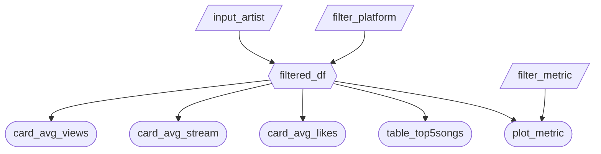

# App Specification

### 2.1 Updated Job Stories

| #   | Job Story                                                                                                                                                                         | Status      | Notes |
| --- | --------------------------------------------------------------------------------------------------------------------------------------------------------------------------------- | ----------- | ----- |
| 1   | When I have to market a new song, I want to know which platform it is likely to perform better on so I can focus my resources.                                                    | In Progress |       |
| 2   | When I am writing a new song for Youtube, I want to see the most liked/viewed songs on that platform so I can determine what song features are associated with stream popularity. | In Progress |       |
| 3   | When I am producing a new song, I want to see what song features perform best with specific KPI metrics so I know how to tailor my production process for high performance.       | In Progress |       |

### 2.2 Component Inventory

| ID                | Type          | Shiny Widget/Renderer | Depends On                        | Job Story  |
| ----------------- | ------------- | --------------------- | --------------------------------- | ---------- |
| `filter_platform` | Input         | `ui.value_box()`      | None                              | #1, #2     |
| `card_avg_views`  | Output        |  `@render.text`       | 'filtered'                        | #2, #3     |
| `filter_metric`   | Input         | `ui.input_select()`   | None                              | #3         |
| `input_artist`    | Input         | `ui.input_text()`     | None                              | #1, #2, #3 |
| `filtered_df`     | Reactive calc | `@reactive.calc`      | `input_artist`, `filter_platform` | #1, #2, #3 |
| `card_avg_stream` | Output        | `@render.text`        | `filtered`                        | #1, #2     |
| `card_avg_likes`  | Output        | `@render.text`        | `filtered`                        | #1, #2     |
| `table_top5songs` | Output        | `@render.data_frame`  | `filtered`                        | #2         |
| `plot_metric`     | Output        | `@render.plot`        | `filter_metric`, `filtered`       | #3         |

### 2.3 Reactivity Diagram

### 2.4 Calculation Details

**`filtered_df`**
- **Depends on:** `input_artist`, `filter_platform`
- **Transformation:** Filters rows to the selected artist and platform. If specific artist is not selected, artist "Beyonce" is set as default. If specific platform is not selected, platform "Both" is set as default.
- **Consumed by:** `card_avg_views`, `card_avg_stream`, `card_avg_likes`, `table_top5songs`, `plot_metric`
